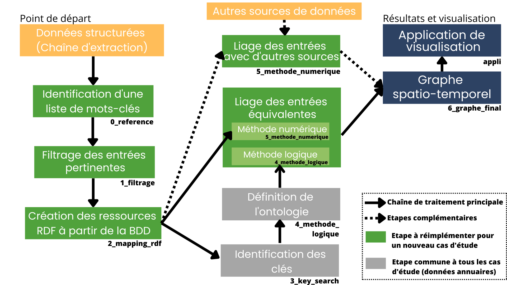

# Construction d'un graphe géohistorique à partir des annuaires du commerce parisien du 19e siècle : application aux photographes

La chaîne de traitement proposée dans le projet SoDuCo pour construire un graphe de connaissances géohistorique à partir des annuaires du commerces parisien du 19e siècle débute par l'extraction du texte des annuaires (4.2) et la reconnaissance des entités nommées (4.3) au sein des entrées. Les approches proposées pour réaliser ces deux étapes sont décrites en détails dans ([Abadie et Al (2022)](https://github.com/soduco/paper-ner-bench-das22)).

La figure ci-dessous décrit les étapes de sélection et représentation des entrées en RDF (4.4), de liage des entrées (4.5) de géocodage (4.6) et de visualisation (5.2), mise en oeuvre à partir de la base de données des entrées d'annuaires.

**L'interface de visualisation des résultats est [disponible ici (version juillet 2023)](https://soduco.github.io/ic_2023_photographes_parisiens/).**<br/>[➡️ Nouvelle version de l'application (novembre 2023) ICI](https://soduco.geohistoricaldata.org/atelier_graphes_geohistoriques_annuaires/)<br/>
**Le endpoint est directement [accessible ici](https://dir.geohistoricaldata.org/).**



## Article et autres ressources
* Article : [voir sur Hal](https://hal.science/hal-04121643)
* Présentation : [voir sur Git-Hub](https://github.com/soduco/ic_2023_photographes_parisiens/blob/main/presentations/IC_2023_Photographes.pdf)
* Pipeline Segmentation + OCR + NER (Abadie et al.) : 
    * Dataset OCR+NER : [](https://doi.org/10.5281/zenodo.6394464)
    * Modèles de NER : [](https://doi.org/10.5281/zenodo.6576008)
    * Extraction complète : [Dépôt Nakala](https://nakala.fr/10.34847/nkl.98eem49t)
* Géocodeur historique : [Accéder à l'API](https://api.geohistoricaldata.org/docs/#/Geocoding)

## Environnement, outils et langages utilisés

* [Graph DB](https://graphdb.ontotext.com/)
* [Python](https://www.python.org/downloads/) (>= 3.8) + bibliothèques (*requirements_python.md*)
* Editeur de code ([Visual Studio Code](https://code.visualstudio.com/download))
* [Postgres](https://www.postgresql.org/download/) 12 avec Postgis (NB : r2rml ne fonctionne pas avec les versions > 12)
* [Sakey](https://lahdak.lri.fr/?q=content/sakey)
* [Silk](https://github.com/silk-framework/silk) : Workbench + Silk en lignes de commande
* [R2RML](https://github.com/nkons/r2rml-parser)
* HTML, CSS, Javascript ([Leaflet](https://leafletjs.com/))
* Pour un déploiement en local de l'application : un serveur Apache (ex : [Laragon](https://laragon.org/download/))

## Citation

```
@inproceedings{Tual_graphe_geohistorique_2023,
  TITLE = {{Création d’un graphe de connaissances géohistorique à partir d’annuaires du commerce parisien du 19ème siècle: application aux métiers de la photographie}},
  AUTHOR = {Tual, Solenn and Abadie, Nathalie and Dum{\'e}nieu, Bertrand and Chazalon, Joseph and Carlinet, Edwin},
  URL = {https://hal.science/hal-04121643},
  BOOKTITLE = {{34es Journ{\'e}es francophones d'Ing{\'e}nierie des Connaissances (IC 2023) @ Plate-Forme Intelligence Artificielle (PFIA 2023)}},
  ADDRESS = {Strasbourg, France},
  SERIES = {IC2023 : 34es Journ{\'e}es francophones d'Ing{\'e}nierie des Connaissances},
  YEAR = {2023},
  MONTH = Jul,
  HAL_ID = {hal-04121643},
}
```

## Remerciements

Ce travail a été soutenu financièrement par l’[Agence Nationale de la Recherche (ANR)](https://anr.fr/Projet-ANR-18-CE38-0013), dans le cadre du projet [SODUCO project](https://soduco.github.io/) (ANR-18-CE38-0013) et par le Ministère des Armées – Agence de l’innovation de défense (AID).